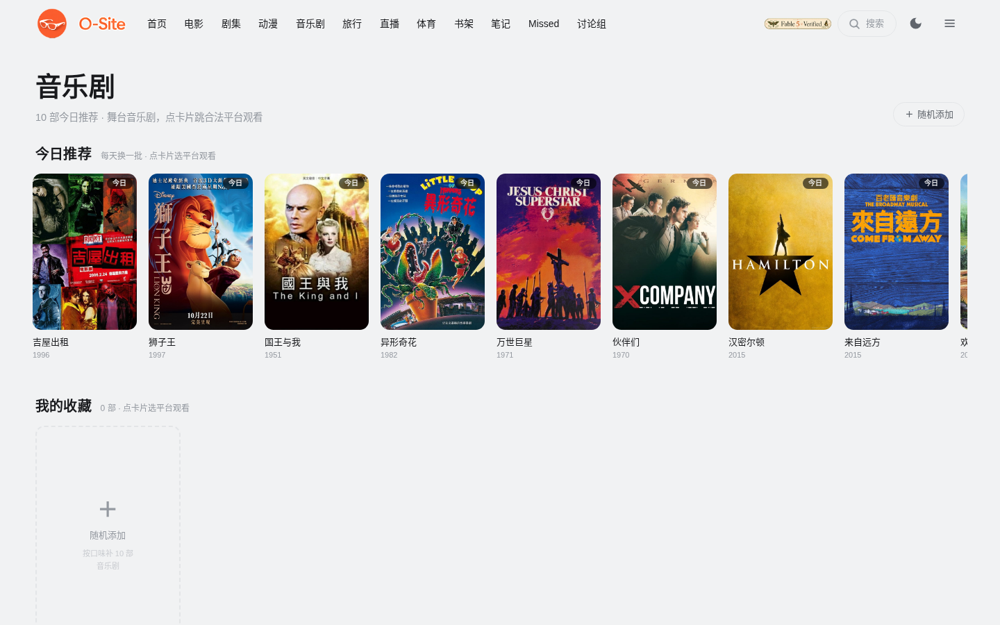
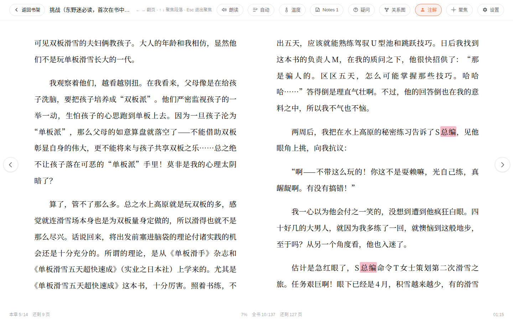
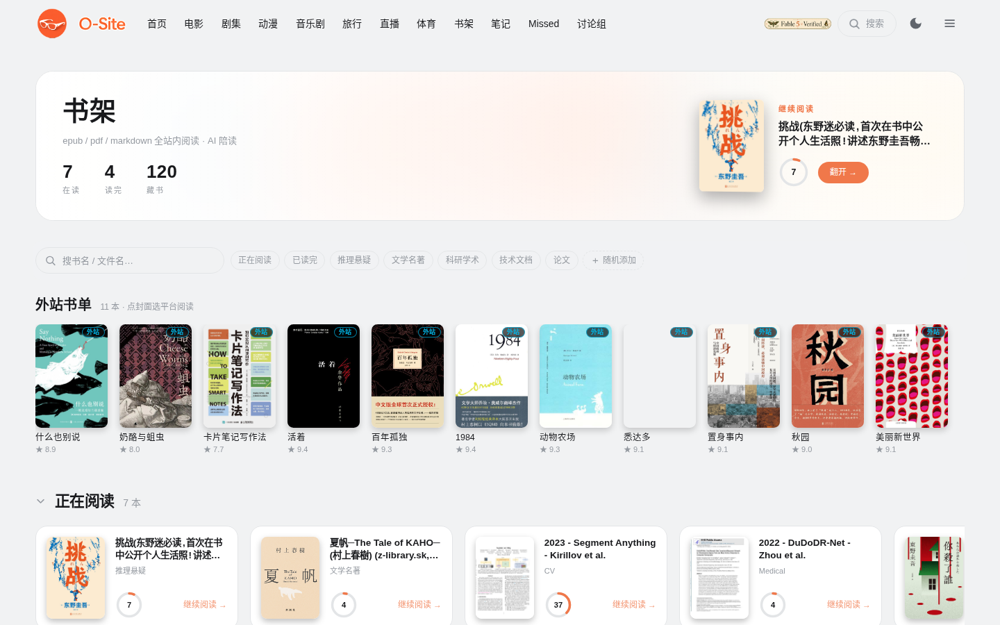
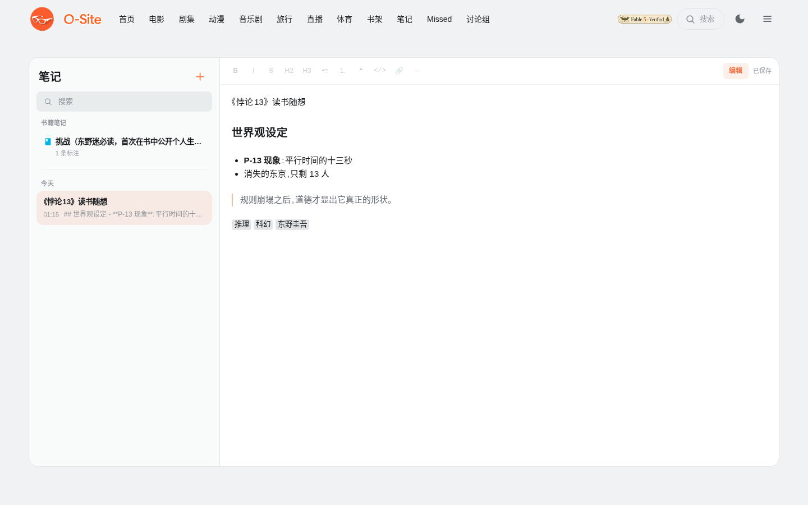
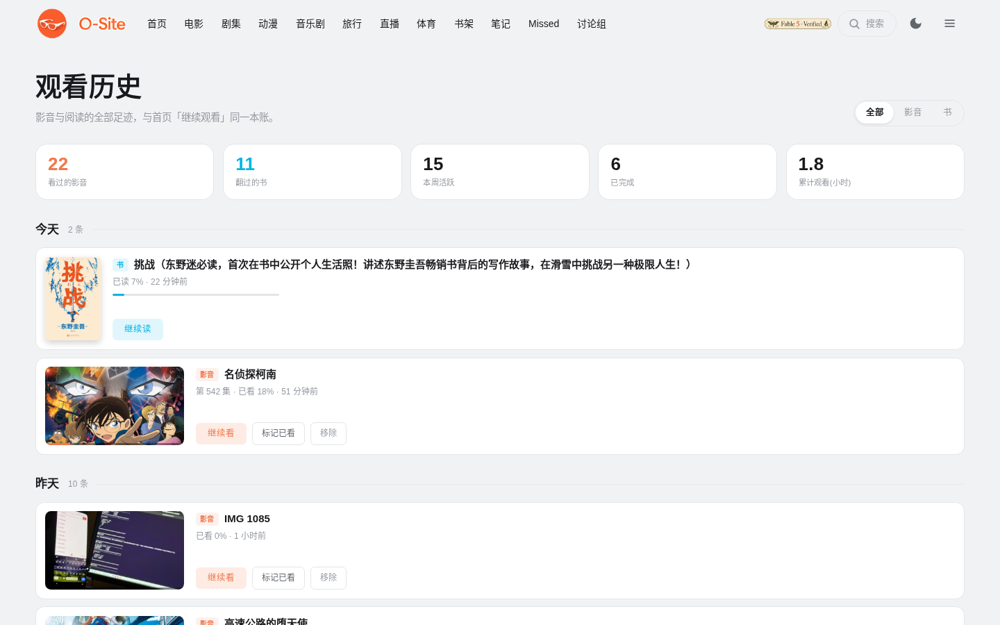
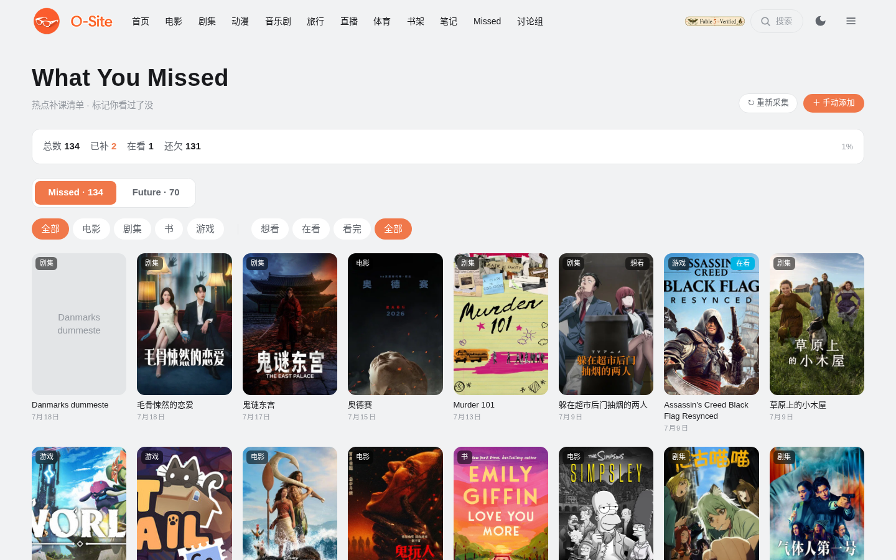
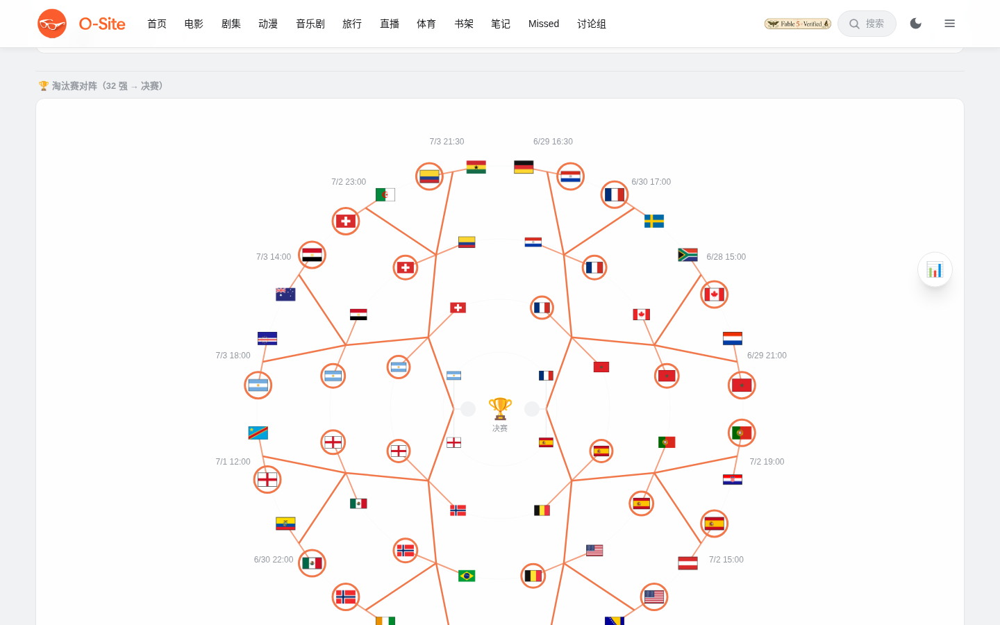

<div align="center">


# O-Site

**你家的私人流媒体帝国。**

电影、剧集、动漫、音乐剧、书籍、直播、体育。想看的，打开就有。

*一台服务器，一个域名，全家人的整个娱乐宇宙。*


`Next.js 15` · `React 19` · `Tailwind v4` · `SQLite` · `WebGL` · `Edge TTS` · `DeepSeek`

**中文** | [English](README.en.md)

</div>

---

## 🎬 这不是一个"网盘播放器"

市面上的家庭媒体方案，大多是文件列表加一个播放按钮。O-Site 想做的是另一件事：把流媒体大厂的体验装进你自己的机器里，然后往前多走几步，做一些大厂不会做的。比如让 AI 记住你读到哪本书的第几页，比如在你翻到悬疑章节时悄悄换上弦乐。

---

## 🏠 首页：会认识你的门厅


*AI 问候、Everyday Different banner、今日热搜、掌舵台、继续观看，一屏尽览*

| 功能 | 它做什么 | 怎么用 |
|---|---|---|
| **AI 个性化问候** | 用村上春树的笔触向你道晚安：读过你近 10 条阅读/观看记录，结合当地天气与时刻，写一段只属于你的话。字号自动填满卡片空隙 | 登录即有，每 3 小时更新一次。DeepSeek key 配好后自动生效，没配则回落时间问候 |
| **今日头条浮卡** | 你库内最值得看的一部，小图轮播 + 一键播放/详情 | hover 暂停轮播，点圆点手动切换 |
| **Everyday Different** | 右侧大 banner：每天一个主题频道（治愈家庭日 / 冒险精神 / 历史长河…12 个主题轮换），TMDB 高分佳作每日换血，GLSL 置换溶解转场 | 点 banner 弹悬浮窗看简介 → 选平台观看；拉不到数据时自动回落库内轮播 |
| **今日热搜** | 影视当日趋势 + 中文图书畅销榜，每天更新 | 点条目弹悬浮窗：先看简介，再选去处（含"先搜搜本站有没有"） |
| **掌舵台** | 三张直达卡：接着看（上次影音）/ 继续阅读（上次的书）/ 手气 | "手气"点开是全屏抽卡动画：卡面越转越慢，定格那张亮起橙光环，可以"就看它"，也可以"算了" |
| **继续观看** | 竖版海报按竖版、横版截帧按横版，原生比例混排一行 | 点卡即续播；"全部记录 →"进历史页 |
| **分区长廊** | 电影、电视剧、动漫、相册四区两行并排，一条横向滚动同步滑，配巨型描边刊号 | 每区"换一批 ↻"手动换血；贴左时左缘无羽化不挡内容 |

## 🎞️ 影音库

**分区浏览**（`/category/movie|series|anime`）

- TMDB 自动刮削海报/简介/评分，扫描即入库；匹配错了在详情页"重新刮削"手动纠正
- 排序：时间 / 名称 / 类型，正序倒序一键切
- 三种条目状态：**已收录**（右上角集数角标）· **未收录**（有条目无分集）· **外站**（青色角标，无本地文件，点击跳合法平台）
- **随机添加**（管理员）：网格第一格的"+"卡 → 两种模式任选——🎲 回答 3 个口味问题（感觉/新老/冷热），AI 从 TMDB 拉 10 部不重复高分佳作；🔍 关键词搜索，候选带海报简介，逐条点"添加"确认

**详情页**：全幅 backdrop 向下渐融进页面，海报悬浮在交界处。选集网格把集号压在图上，上次看到哪集有"看到这"角标，hover 浮出播放钮。

**播放器**：HLS 转码、内嵌字幕、快捷键（空格暂停，←→ 快进退）、收藏标记、进度实时上报。



**音乐剧专区**（`/category/musical`）：48 部百老汇与西区的精选清单（Hamilton、歌剧魅影、悲惨世界、Wicked 都在），每天轮换 10 部推荐。点卡片直接跳 B站官摄、腾讯、YouTube 或 BroadwayHD。

## 📚 阅读器：AI 陪你翻完整本书



*双栏排版 · AI 注解词高亮可点 · 顶栏一排：朗读 / 自动阅读 / 聚焦 / 温度 / 关系图 / 问答*

EPUB / PDF / Markdown 通吃，进书架点封面即读。

| 功能 | 它做什么 | 怎么用 |
|---|---|---|
| 🌡️ **故事温度计** | AI 逐页感知情节紧张度（0 到 100），进度条颜色随剧情升温降温，旁边配一个气氛词，比如"山雨欲来"或"温情脉脉" | 工具栏开"温度"；结果按页缓存，翻回去零 token |
| 🎻 **氛围音乐引擎** | 本地曲库按 10 情绪桶编目，随剧情自动配乐：悬疑弦乐渐入、温情钢琴响起，crossfade 无缝切换，"非必要不切"（情绪突变或 5 页 150 秒才换曲），20 分钟内不重播 | 温度按钮上的小喇叭开关；当前曲名显示在页面右下角 |
| 🎙️ **多音色朗读** | 旁白与引号对话自动分音色，说话人男女自动辨认（扫上下文人名+注解表），同一角色整本书声线恒定，卡拉OK式逐字变色 | 工具栏"朗读"；"自动阅读"先测你的读速再按节奏推进翻页 |
| 🤖 **Agentic 问答** | 划词或直接提问，AI 像侦探一样在你读过的部分里翻找原文佐证，绝不看你没读到的地方，所以永不剧透。它搜索、翻书的每一步都实时显示 | 支持同音字人名容错（语音输入友好）；论文 PDF 自动切论文模式 |
| ✍️ **术语注解** | 划词录入词条，AI 解读含义并标注男女（供朗读用），点注解词随时弹出 | 划词 → "录入为词条"；AI 解读一键生成 |
| 🕸️ **人物关系图** | 按当前进度生成 Mermaid 人物关系谱 + 文字说明，读长篇不迷路 | 工具栏"关系图"；只用最少 token |
| 🎯 **聚焦模式** | 段落聚光灯（ADHD 友好），↑↓ 逐段推进，Esc 退出 | 支持 PDF 段落几何反推 |
| 📝 **阅读笔记** | 荧光笔高亮 + 图片拖入，可拖浮窗，跳转/跳回 | 自动同步到全站"笔记"页（见下） |
| 🎨 **外观** | 字号/字体/行距/加粗/背景主题/翻页方式；**日夜与全站主题双向同步**，进出阅读器丝滑滑入滑出、永不闪白 | 设置面板即改即生效 |



**书架**（`/bookshelf`）：Apple Books 式的搁板，真实封面立在上面。在读的书有大卡和圆环进度，读完的进"已读完"专栏。还有一排外站书单，是豆瓣榜单来的推荐，点封面就跳微信读书或 Anna's Archive。

## 🌐 Fetch Out As We Can

本站没有的资源？不装死，帮你找。

- **八方位悬浮窗**：从你的鼠标位置展开，按屏幕 3×3 分区自动选方向，不会被屏幕边缘裁掉。先给你看简介，再列平台。
- **平台矩阵**：影视→腾讯/爱奇艺/B站/优酷 + JustWatch 兜底；动漫→B站优先 + Crunchyroll；音乐剧→B站官摄/YouTube/BroadwayHD；图书→微信读书/豆瓣/Anna's Archive/京东 + Google Books


- **B站站内嵌入观看**（`/embed`）：不离开本站看B站。站内搜索，整页 iframe 打开（能登录B站账号、能切高画质），观看时长自动记录，下次从"继续看"横条一键回位。所有 fetch-out 菜单里的 B站条目都直达这里。

## ✨ 生活区

<table><tr>
<td width="50%"><br /><em>笔记：iPad 备忘录颜值 × Markdown 内核（预览模式）</em></td>
<td width="50%"><br /><em>观看历史 Dashboard：统计卡 + 影音与书同账时间线</em></td>
</tr><tr>
<td width="50%"><br /><em>Missed：热点补课清单</em></td>
<td width="50%"><br /><em>体育：世界杯五环对阵图，比分自动刷新</em></td>
</tr></table>

| 页面 | 功能与用法 |
|---|---|
| **📝 笔记**（`/notes`） | iPad 备忘录颜值 × Markdown 内核：左列搜索+时间分组，右侧编辑区首行即标题、800ms 自动保存；顶部工具栏 **B/I/删除线/H2/H3/列表/引用/代码/链接/分隔线**，一键"预览"切渲染视图；阅读器荧光笔标注按书聚合成只读 ref，点击跳回原书原位 |
| **📊 观看历史**（`/history`） | Dashboard：五张统计卡（看过的影音/翻过的书/本周活跃/已完成/累计时长）+ 影音与书**同一本账**的时间线（今天/昨天/过去7天/更早分组），全部/影音/书过滤，续播/标记已看/移除 |
| **⭐ 收藏**（`/favorites`） | 播放页标记的影剧汇集于此 |
| **📃 播放列表**（`/playlists`） | 把想连着看的视频排进队列，顺序连播 |
| **🔥 Missed**（`/missed`) | 热点补课清单：近半年热门电影/剧集/书/游戏自动采集，默认无状态，点一下循环 无→想看→在看→看完；已在库的自动按你的观看记录推导状态 |
| **⚽ 体育**（`/sports`） | 世界杯五环淘汰赛对阵图（32强→决赛），比分随 ESPN 60 秒自刷，胜者自动晋级填座；**金=冠军 银=亚军 铜=季军**名次环；点比赛自动匹配直播源 |
| **📡 直播**（`/live`） | 嵌入直播画面 + 本地音频 + 实时弹幕叠加，自由大小画中画浮窗 |
| **💬 讨论组**（`/forum`） | Reddit 式帖子+评论，登录即用，基本限流 |
| **🔍 全站搜索** | 顶栏"搜索"按钮 → 面板从按钮位置平移飞出：影音/书籍/栏目一网打尽，空态带快捷动作（继续上次/切主题/直达页面），↑↓ Enter 全键盘导航；书籍栏底部可一键去 Internet Archive 接着搜 |

## 🛡️ 权限：一家之主说了算

- Google 一键登录。未登录就是一个空白网站：不记录任何数据，也没有个人化内容。
- boss 逐用户开栏目（`/admin/users` → 内容范围）：电影、剧集、动漫、书架、直播、体育、Missed、音乐剧、笔记，逐项勾选或全部开放。给孩子开动漫和书架，给自己留全部。
- 私密内容（保险箱、旅行相册）只有 boss 能看，配设备级口令信任：验证一次，这台设备一年免输。
- 进度、收藏、笔记、历史在用户之间完全隔离。随机添加和外站条目管理只有管理员能碰。
- 后台有用户行为监督和 AI 成本看板，DeepSeek 每一次调用的 token 和费用都按组件分账。

## 🚀 起飞

```bash
npm install
npm run build
npm start          # 生产模式，端口自定（如 next start -p 3024）
```

1. 设置页（`/settings`）填 TMDB API key，后台扫描媒体目录，海报和简介自动到位
2. `~/.config/deepseek-token` 放 DeepSeek key，AI 问候、温度、问答、注解全部点亮
3. 本地音乐放进 `~/Music`，管理后台编目一次，阅读器的氛围音乐就绪
4. `/admin/users` 给家人开栏目，各自登录，各看各的

> 数据库、图片缓存、密钥都在 `data/` 和系统配置目录里，不进 git。你的库只属于你。

---

<div align="center">

*Built with obsession, for the living room.*

**O-Site**，把"今晚看什么"变成最幸福的难题。

</div>

<sub>License: [CC BY-NC 4.0](LICENSE) · 自由分享与改编，禁止商用</sub>
