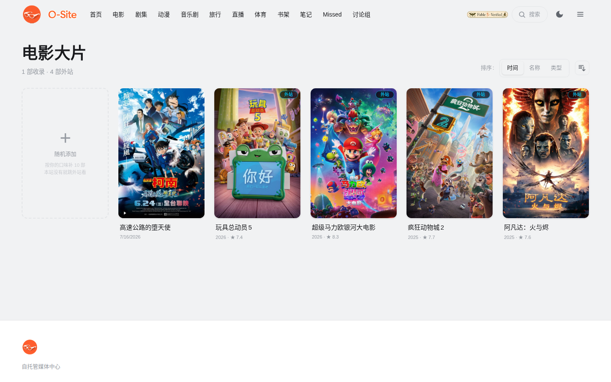

<div align="center">


# O-Site

**你家的私人流媒体帝国。**

电影、剧集、动漫、音乐剧、书籍、直播、体育。想看的，打开就有。

*一台服务器，一个域名，全家人的整个娱乐宇宙。*


`Next.js 15` · `React 19` · `Tailwind v4` · `SQLite` · `WebGL` · `Edge TTS` · `DeepSeek`

**中文** | [English](README.en.md)

</div>

---

市面上的家庭媒体方案，大多是文件列表加一个播放按钮。O-Site 想做的是另一件事：把流媒体大厂的体验装进你自己的机器里，然后往前多走几步，做一些大厂不会做的。比如让 AI 记住你读到哪本书的第几页，比如在你翻到悬疑章节时悄悄换上弦乐。

## 🏠 首页

[](docs/features/home.md)

会认识你的门厅：AI 用村上春树的笔触向你道晚安，Everyday Different banner 每天换一个主题频道，热搜榜每天更新，掌舵台一键回到上次的进度。

**[→ 首页详解：问候卡 · banner · 热搜 · 掌舵台 · 抽卡 · 长廊](docs/features/home.md)**

## 🎞️ 影音库

[](docs/features/library.md)

TMDB 自动刮削，影院化详情页，HLS 播放器。库里没有的内容管理员可以"随机添加"或按关键词搜着加，成为可跳外站观看的条目。

**[→ 影音库详解：分区 · 随机添加 · 详情页 · 播放器 · 视频源抽屉](docs/features/library.md)**

## 📚 阅读器

[](docs/features/reader.md)

AI 陪你翻完整本书：故事温度计、氛围音乐、多音色朗读、永不剧透的问答、人物关系图、聚焦模式。EPUB、PDF、Markdown 通吃。

**[→ 阅读器详解：九大功能逐一配图](docs/features/reader.md)**

## 🌐 Fetch Out As We Can

[](docs/features/fetch-out.md)

本站没有的资源，不装死，帮你找：八方位悬浮窗先给简介再列平台，B站内容直接站内嵌入观看（可登录、可切高画质、自动记进度）。

**[→ Fetch Out 详解：悬浮窗 · 平台矩阵 · B站嵌入](docs/features/fetch-out.md)**

## 🎭 音乐剧

[](docs/features/musical.md)

48 部百老汇与西区精选（Hamilton、歌剧魅影、悲惨世界都在），每天轮换推荐，点卡直达官摄平台。

**[→ 音乐剧详解：精选清单 · 每日推荐 · 收藏管理](docs/features/musical.md)**

## ✨ 生活区

[](docs/features/living.md)

笔记（iPad 备忘录颜值 × Markdown 内核）、观看历史 dashboard、Missed 热点补课、世界杯对阵图、直播、论坛、全站搜索。

**[→ 生活区详解：七个页面逐一配图](docs/features/living.md)**

## 🛡️ 权限

Google 一键登录，boss 逐用户开栏目。给孩子开动漫和书架，给自己留全部。进度、收藏、笔记在用户之间完全隔离。

**[→ 权限体系详解：角色 · scope · 私密内容 · 数据隔离](docs/features/permissions.md)**

## 🚀 起飞

```bash
npm install
npm run build
npm start          # 生产模式，端口自定（如 next start -p 3024）
```

1. 设置页（`/settings`）填 TMDB API key，后台扫描媒体目录，海报和简介自动到位
2. `~/.config/deepseek-token` 放 DeepSeek key，AI 问候、温度、问答、注解全部点亮
3. 本地音乐放进 `~/Music`，管理后台编目一次，阅读器的氛围音乐就绪
4. `/admin/users` 给家人开栏目，各自登录，各看各的

> 数据库、图片缓存、密钥都在 `data/` 和系统配置目录里，不进 git。你的库只属于你。

---

<div align="center">

*Built with obsession, for the living room.*

**O-Site**，把"今晚看什么"变成最幸福的难题。

<sub>License: [CC BY-NC 4.0](LICENSE) · 自由分享与改编，禁止商用</sub>

</div>
