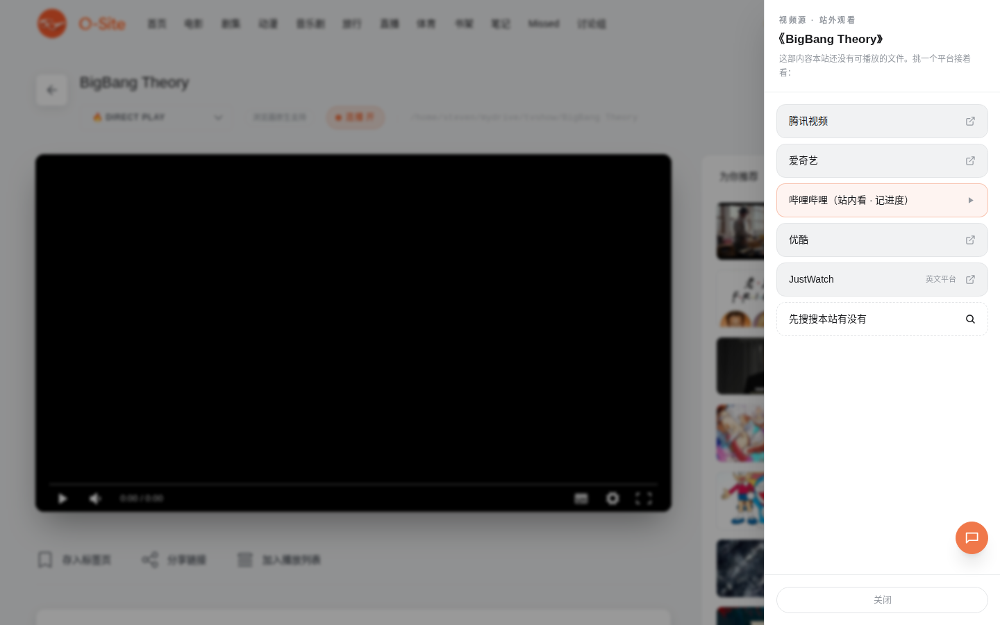

# Fetch Out As We Can

[← 返回 README](../../README.md)

本站没有的资源，不装死，帮你找。这套机制贯穿全站：热搜、外站条目、音乐剧、外站书单、未收录内容，点开都是同一套体验。

## 八方位悬浮窗

点击任何外站内容，悬浮窗从你的鼠标位置展开。方向由屏幕 3×3 分区自动决定：点在四角就朝对角展开，点在边缘就朝屏幕内侧展开，点在中间就向下展开。无论点在哪里，整个窗口都完整可见，不会被屏幕边缘裁掉。

窗口结构从上到下：

1. 标题
2. 简介（默认三行，点一下展开全文）。先知道讲什么，再决定去哪看
3. 平台列表，点击新标签打开对方的官方搜索页
4. 附加动作（如"先搜搜本站有没有"）

手机上退化为底部抽屉。

## 平台矩阵

| 内容类型 | 中文平台 | 英文兜底 |
|---|---|---|
| 电影 / 剧集 | B站站内观看、腾讯视频、爱奇艺、优酷 | JustWatch |
| 动漫 | B站站内观看、腾讯视频、爱奇艺 | Crunchyroll |
| 音乐剧 | B站站内观看（官摄多）、腾讯视频 | YouTube、BroadwayHD |
| 图书 | 微信读书、豆瓣读书、Anna's Archive、京东 | Google Books |

全部走各平台官方搜索 URL，不做任何盗链。跳过去看到什么、要不要开会员，由平台说了算。

## B站站内嵌入观看

`/embed`，所有 fetch-out 菜单里的 B站条目都直达这里。

**搜索**：输入片名、UP主或关键词即搜，结果网格带封面、UP主、时长、播放数。服务端代理 B站搜索接口，自动处理 cookie。

**播放**：点视频进 80vh 的整页 iframe，加载的是 B站主站页面。你可以在里面正常登录自己的 B站账号、切大会员高画质，嵌入版播放器做不到的这里都行。

**进度**：iframe 跨域读不到播放器的时间轴，所以用观看时长估算：播放器开着时每 30 秒记一次（切走页面自动暂停计数）。"继续看"横条一键回位，续播时自动从记录点开播。进度是估算值，拖了进度条它不知道，但"看到大概哪里"足够。

## 未收录内容的视频源抽屉

点开一部没有本地文件的内容，右侧滑出"视频源"抽屉：B站站内观看置顶（橙色高亮），下列各平台，末尾站内搜索。正常播放的内容完全无感。

## 外站条目（第三态）

分区里青色"外站"角标的条目没有本地文件，是管理员通过[随机添加](library.md#随机添加管理员)导入的推荐。点击弹悬浮窗选平台，hover 可移除。它们和本地条目一起排在网格里，家人浏览时不需要区分"有没有下载"，想看就点。
