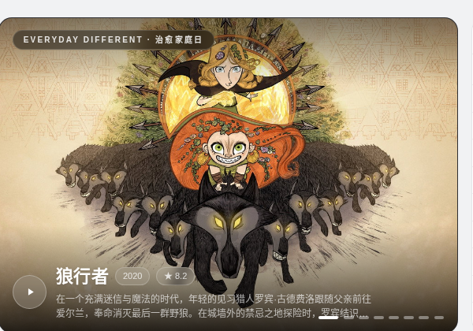
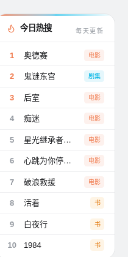
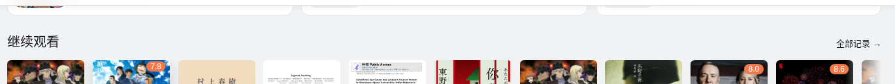
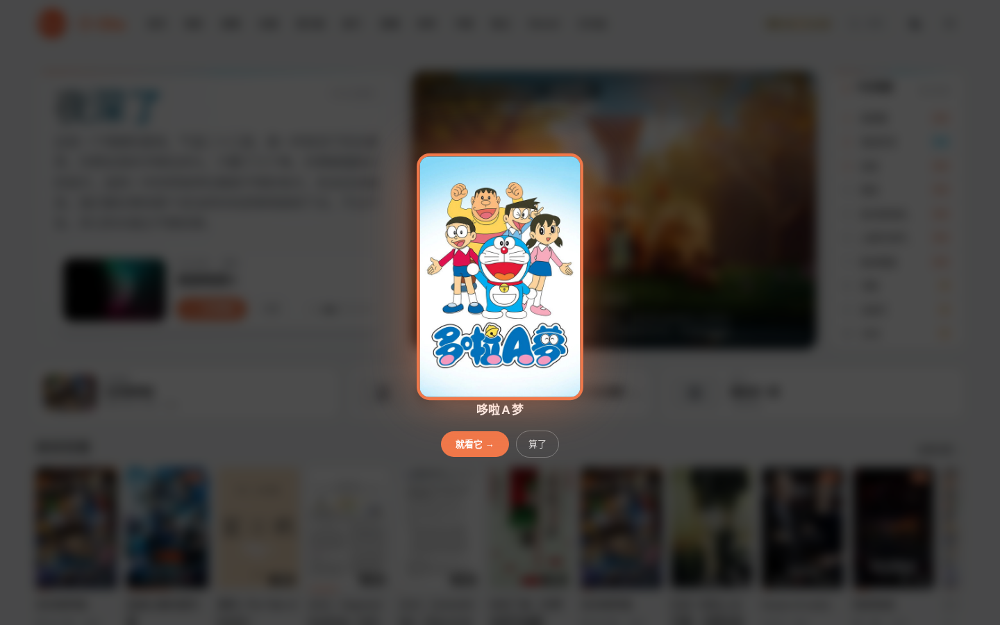
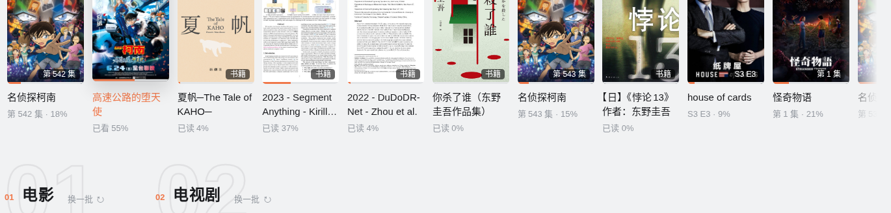
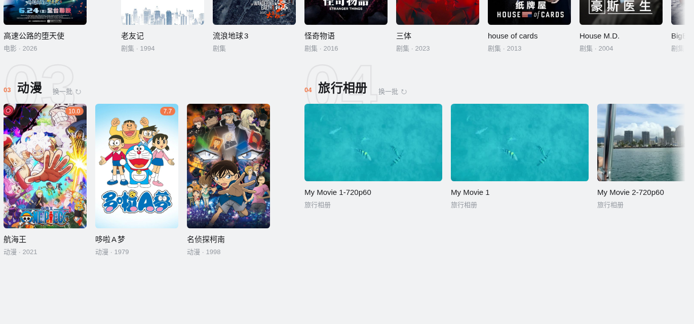

# 首页

[← 返回 README](../../README.md)

一屏之内放下你今晚需要的全部决策信息：左边是认识你的问候卡，右边是每天不重样的推荐 banner 和热搜榜，往下是掌舵台、继续观看和分区长廊。

## AI 个性化问候

登录后，DeepSeek 读你最近 10 条阅读和观看记录，结合当地天气与时刻，用村上春树式的语调写一段话。读到一半的书、追到一半的剧，它都会淡淡提一句。

- 大标题固定三字（夜深了 / 晚上好 / 早上好），正文字号自动放大缩小，恰好填满卡片空隙
- 每 3 小时更新一次，同一时段走缓存
- 没配 DeepSeek key 时回落成普通时间问候
- 右上角日期徽章，卡底几颗缓慢明灭的小星
- 下方是今日头条浮卡：库内最值得看的一部，小图轮播，hover 暂停，一键播放

## Everyday Different banner

每天一个主题频道，12 个主题轮换（治愈家庭日、冒险精神、历史长河……），片单每天换血，全部是 TMDB 高分作品，恐怖惊悚犯罪战争一律排除。

- 换片过渡是 GLSL 置换溶解：两张图沿噪声流场撕开重组
- 点 banner 弹 fetch-out 悬浮窗，先看简介再选平台
- 图片全部预载完成才切换，不会出现半张图；拉不到数据自动回落库内轮播

## 今日热搜

影视当日全球趋势加中文图书畅销榜，每天更新。前三名橙色加粗，每条带类型徽章。点任何一条弹悬浮窗，先读简介再决定去处。

## 掌舵台

三张直达卡：接着看（上次影音）、继续阅读（上次的书）、手气。

"手气"点开是全屏抽卡动画：候选海报越转越慢，定格那张亮起橙色光环。1.6 秒后自动进入，也可以点"就看它"或"算了"。

## 继续观看

竖版海报按 2:3、横版截帧按 16:9，原生比例混排一行，不做强行拉伸。一行放得下几张放几张，超出裁掉并右缘渐隐。点卡片从上次位置续播。

## 分区长廊

电影、电视剧、动漫、旅行相册排成两行，共用一条横向滚动，滑一下四个区一起动。巨型描边刊号，每区可"换一批"。贴左时左缘不羽化，第一张卡完整可见。
