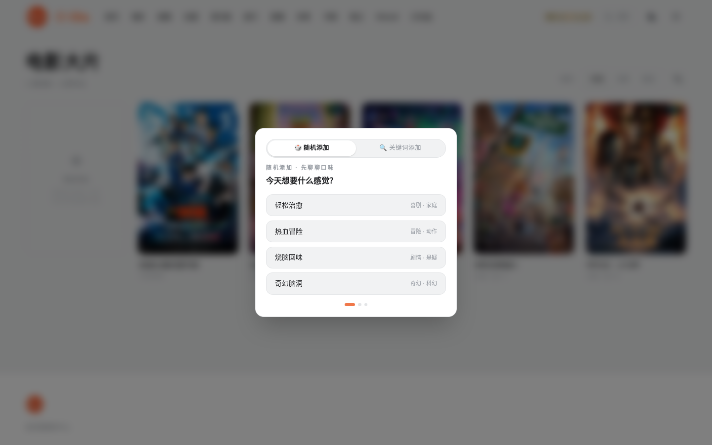
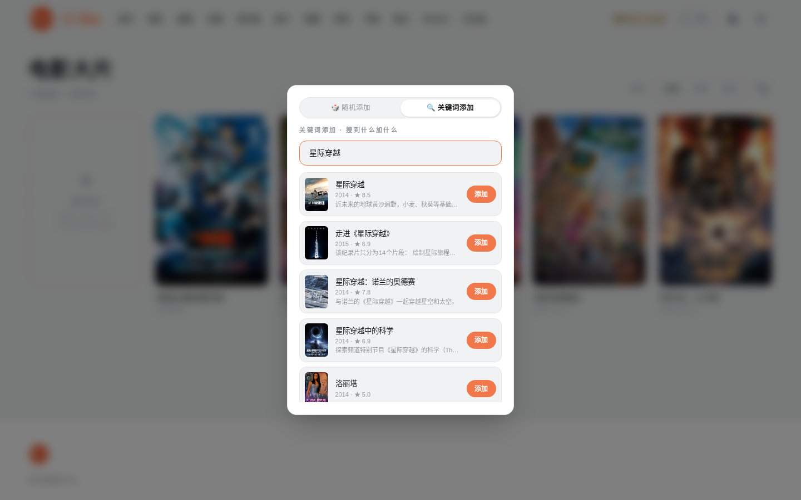

# 影音库

[← 返回 README](../../README.md)

## 分区浏览

`/category/movie` `/category/series` `/category/anime`

- 扫描媒体目录即入库，TMDB 自动刮削海报、简介、评分
- 排序支持时间、名称、类型，正序倒序一键切换
- 大分区分块渲染：先出 60 张，滚近底部再补，几百部也不卡

三种条目状态：

| 状态 | 标识 | 含义 |
|---|---|---|
| 已收录 | 右上角集数角标 | 有本地文件，点进详情页选集播放 |
| 未收录 | 胶囊"未收录"角标 | 库里有条目但一集都没有 |
| 外站 | 青色"外站"角标 | 无本地文件，点击弹平台菜单跳合法外站 |

## 随机添加（管理员）

网格第一格的虚线"+"卡。打开后两种模式：

**🎲 随机模式**：回答三个口味问题（想要什么感觉 / 新老口味 / 热门还是冷门），系统按答案从 TMDB 拉 10 部与库内和已添加内容都不重复的高分作品，一次入库。

**🔍 关键词模式**：输入片名即搜（350ms 防抖），候选列表带海报、年份、评分和一行简介，逐条点"添加"确认。已添加的变灰防重复，可以连续加多条。

两种模式的入库内容都会带完整简介和海报，成为"外站"条目。普通用户看不到"+"入口，后端同样有管理员校验。

## 详情页

全幅 backdrop 从顶部铺下来，向下渐融进页面底色，海报悬浮在交界处。元信息一行小字：类型、年份、评分、集数、类型词。

选集网格：

- 集号（01、02…）压在缩略图左下角
- 上次看到的那集有橙色描边和"看到这"角标
- hover 时图片微放大，浮出白色圆形播放钮
- 多季剧顶部有季数胶囊切换

海报或简介匹配错了，点"重新刮削"手动从 TMDB 候选里选正确的条目覆盖。

## 播放器

- HLS 实时转码，快进秒响应
- 内嵌字幕自动提取，多字幕轨切换
- 快捷键：空格暂停，左右方向键快进退
- 收藏标记、播放列表、进度实时上报
- 公网通道的受限用户自动锁 720p/30fps 转码（省流量，boss/admin 与内网不受限）

## 未收录内容的视频源菜单

点开一部没有本地文件的内容时，右侧滑出"视频源"抽屉：B站站内观看置顶（橙色高亮，可登录可切高画质、自动记进度），下列腾讯视频、爱奇艺、优酷、JustWatch，最后一项是站内搜索。正常播放的内容完全无感，只有真的播不出来才会弹。
