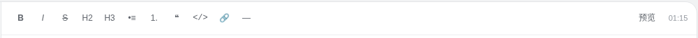
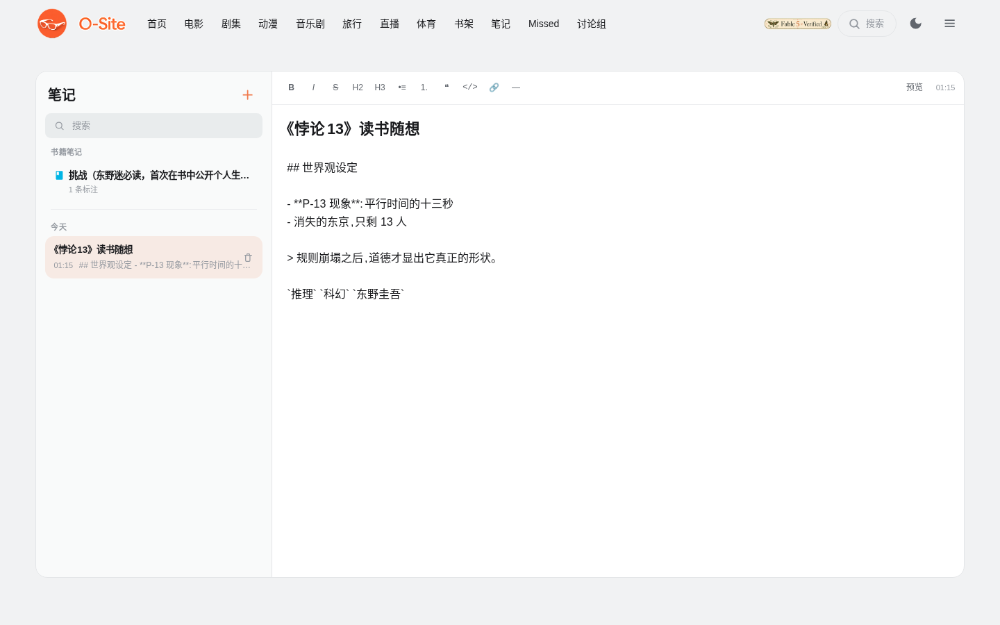
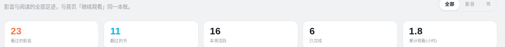
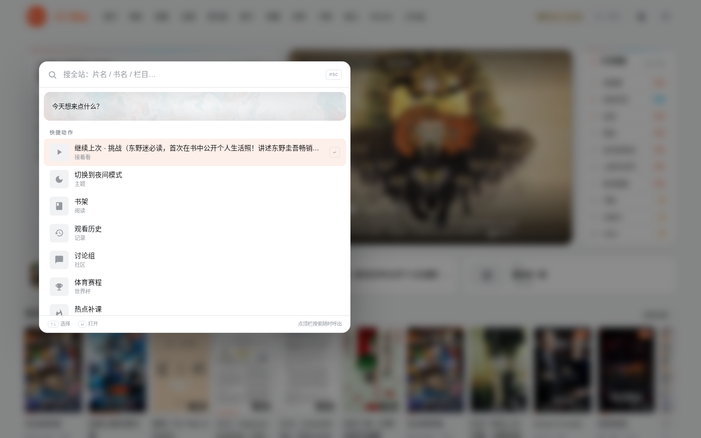

# 生活区

[← 返回 README](../../README.md)

影音书之外的日常件：笔记、历史、热点补课、体育、直播、论坛、搜索。

## 笔记

*预览模式：标题、列表、引用、标签全部渲染*

iPad 备忘录的样子，Markdown 的里子。左列是搜索框加时间分组的列表（今天 / 昨天 / 过去 7 天 / 更早），右侧编辑区首行即标题，打字 800ms 后自动保存，右上角实时显示"保存中 / 已保存"。

*编辑模式顶栏：B、斜体、删除线、H2、H3、列表、引用、代码、链接、分隔线，一键切预览*

阅读器里的荧光笔标注按"一本书一条"聚合进左列顶部的"书籍笔记"区，只读，点击直接跳回原书原位。每个用户的笔记完全私有。

## 观看历史

一个 dashboard，不是流水账。

*五张统计卡：看过的影音、翻过的书、本周活跃、已完成、累计观看时长*

时间线把影音和书混排在一起（与首页"继续观看"同一个数据源，两边永远一致），按今天 / 昨天 / 过去 7 天 / 更早分组。影音条目可以续播、标记已看、移除；书条目显示阅读进度条，一键继续读。右上角"全部 / 影音 / 书"过滤。

## Missed 热点补课

近半年的热门电影、剧集、书、游戏自动采集成清单，帮你补上错过的。

卡片默认无状态，点一下循环：无 → 想看 → 在看 → 看完 → 清除。已经在库里看过的，状态按你的真实观看记录自动推导。顶部可按栏目和状态过滤，也能手动添加条目。

## 体育

世界杯淘汰赛的五环对阵图：32 强在最外圈，一路向内到决赛。比分随 ESPN 每 60 秒刷新，胜者自动晋级填进下一环。冠军金环、亚军银环、季军铜环。点任何一场比赛自动匹配直播源。

## 直播

嵌入直播画面，本地音频与实时弹幕叠加，画中画浮窗大小随意拖。

## 讨论组

Reddit 式的帖子加评论，登录即用，带基本限流。

## 全站搜索

顶栏"搜索"按钮一点，面板从按钮位置平移飞出。影音、书籍、栏目一网打尽；空态给快捷动作（继续上次、切主题、直达各页）；↑↓ 加回车全键盘操作。书籍结果的底部有一键去 Internet Archive 接着搜。
