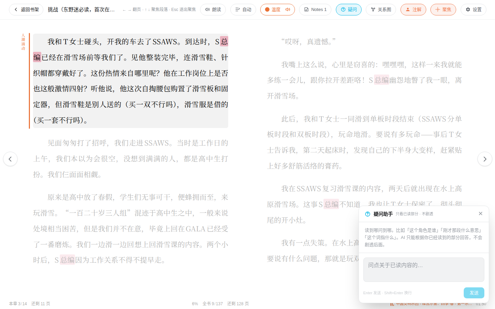
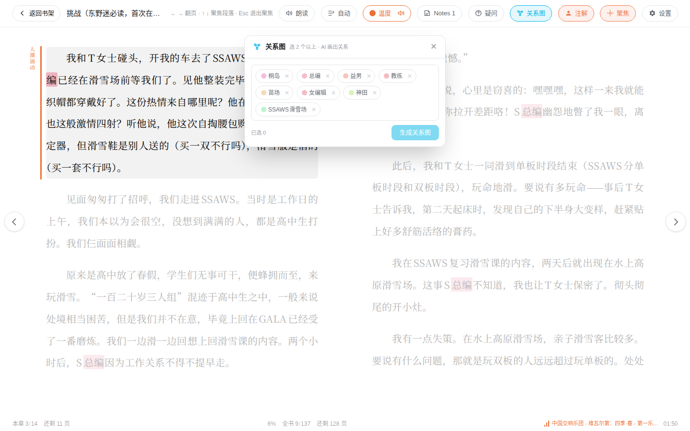
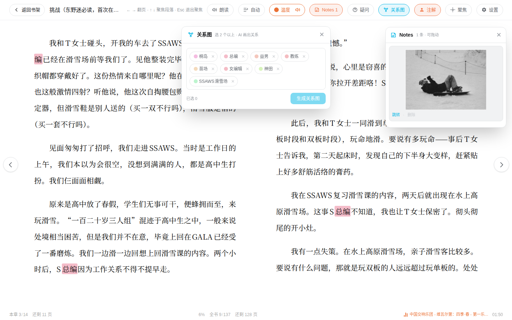
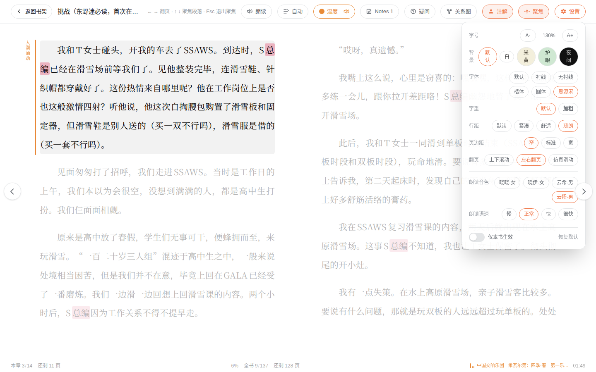

# 阅读器

[← 返回 README](../../README.md)

EPUB、PDF、Markdown 都能读。书架点封面即开，进出有滑入滑出转场，日夜模式跟全站同步，不闪白。

顶栏一排就是全部武器：

## 故事温度计

*底部状态栏：本章进度、全书进度，右下角是氛围音乐当前曲目*

AI 逐页感知情节的紧张程度，给出 0 到 100 的温度值。进度条颜色随剧情升温降温，旁边配一个四字气氛词，比如"山雨欲来"或"温情脉脉"。

- 结果按页缓存，翻回去过的页零 token
- 新章节的温度窗口不会跨回上一章
- 变色是 10 秒渐变，不会突兀地跳

## 氛围音乐引擎

把你 `~/Music` 里的本地曲库按 10 个情绪桶编目（平静、温情、伤感、神秘、紧张、黑暗、史诗、壮丽、孤独、浪漫），阅读时随剧情自动配乐。悬疑段落弦乐渐入，温情场景钢琴响起。

克制是设计核心：

- 换曲用 crossfade，无缝过渡
- "非必要不切"：情绪强度突变两档以上，或者连续读了 5 页超过 150 秒，才考虑换曲
- 20 分钟内不重播同一首
- 器乐优先于人声

开关在温度按钮上的小喇叭，当前曲名显示在页面右下角。

## 多音色朗读

- 旁白一个音色，引号里的对话另配音色
- 说话人的性别自动辨认：扫描对话前后的人名，再查注解表里的性别标注
- 同一个角色整本书声线恒定
- 卡拉OK式逐字变色，跟着读到哪
- "自动阅读"会先测你读一页的速度，之后按你的节奏自动推进翻页

## Agentic 问答

划一段文字提问，或者直接问。AI 像侦探一样在你**读过的部分**里 grep 原文找佐证，绝不看你还没读到的地方，所以永远不会剧透。

- 它搜索、翻书的每一步都实时显示在对话气泡里
- 人名支持同音字容错，语音输入打错字也能对上
- 全书注解表作为基础背景喂给它
- PDF 论文自动切换成论文模式，问方法问结论都行

## 术语注解

划词，点"录入为词条"。AI 一键生成解读，顺便标注人物性别（朗读引擎用）。之后正文里这个词会高亮，随时点开浮窗回看。

## 人物关系图

一键生成当前进度的 Mermaid 人物关系谱，配文字说明。只按读到的部分画，长篇群像再也不迷路。

## 聚焦模式

段落聚光灯：当前段落亮起，其余压暗。上下方向键逐段推进，Esc 退出。对注意力容易漂移的阅读很友好，PDF 也支持（用段落几何反推位置）。

## 阅读笔记

荧光笔高亮加图片拖入，浮窗可以拖着走，点笔记跳回原文位置。所有标注自动出现在全站的[笔记页](notes.md)里。

## 外观设置

字号、字体、行距、加粗、背景主题、翻页方式，即改即生效。

## 书架

Apple Books 式的搁板，真实封面立在上面（EPUB 内嵌图、PDF 首页渲染，都提不出来就用生成式素色书封）。在读的书有大卡和圆环进度，读到 98% 以上进"已读完"专栏。搜索即时过滤，分类快跳钉在顶栏下面。

*书架 hero：环境光晕随在读封面变色，右侧是继续阅读大卡*

书架有缓存，进出秒开；进度永远实时拉取，不会显示旧进度。
